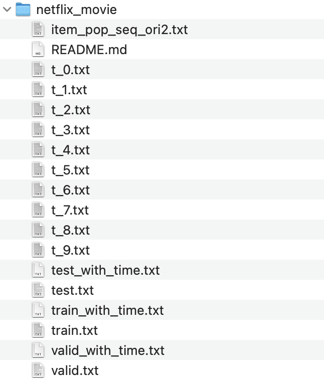

Please download the original data from at this [URL](https://www.kaggle.com/datasets/netflix-inc/netflix-prize-data/data). Download combined_data_1.txt, because the single data file is large enough for us to train the model.

Then run through [nt_data_processing](https://github.com/bettygong/DSC180B-popularity-bias-in-Netflix-dataset/tree/main/PDA/data) and [netflix_data1_split_PDA](https://github.com/bettygong/DSC180B-popularity-bias-in-Netflix-dataset/tree/main/PDA/data) to obtain the needed data format. Move the data files to the netflix_movie folder, and the resulting folder should look like the following: 

